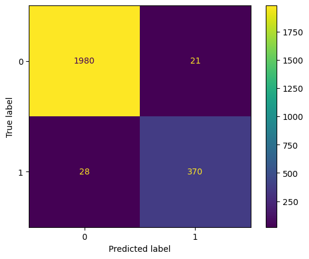

# EDA-and-Random-Forest-model-for-HR

### Overview

This project comes from the last capstone course of the Google Advanced Data Analytics Professional Certificate on Coursera.

The goal of this project was to create a model to predict if employees are likely to quit or not. This project used a dataset containing information of employees such as satisfactory level, number of projects, average monthly hours. The final random forest model performed with 97% accuracy, 94% precision and 92% recall determining what features were most important in separating people who quit and not.

### Data Understanding

#### HR dataset

The dataset contains 15,000 rows and 10 columns for the variables listed below. 

**Note:** For more information about the data, refer to its source on [Kaggle](https://www.kaggle.com/datasets/mfaisalqureshi/hr-analytics-and-job-prediction?select=HR_comma_sep.csv).

| Variable              | Description                                                  |
| --------------------- | ------------------------------------------------------------ |
| satisfaction_level    | Employee-reported job satisfaction level [0&ndash;1]         |
| last_evaluation       | Score of employee's last performance review [0&ndash;1]      |
| number_project        | Number of projects employee contributes to                   |
| average_monthly_hours | Average number of hours employee worked per month            |
| time_spend_company    | How long the employee has been with the company (years)      |
| Work_accident         | Whether or not the employee experienced an accident while at work |
| left                  | Whether or not the employee left the company                 |
| promotion_last_5years | Whether or not the employee was promoted in the last 5 years |
| Department            | The employee's department                                    |
| salary                | The employee's salary (U.S. dollars)                         |

There were no missing values in the dataset, but several duplicated rows. These were removed from the dataset.

### Modeling and Evaluation 

A random forest model comprising 500 decision trees was used to determine feature importance in who would quit or not. The plot above shows that in this random forest model, satisfaction_level, number_project, last_evaluation, time_spend_company and average_monthly_hours are the most important factors in determining if someone would quit or not.  

The overall model performed with 97% accuracy, 94% precision and 92% recall, shown below by the confusion matrix.

